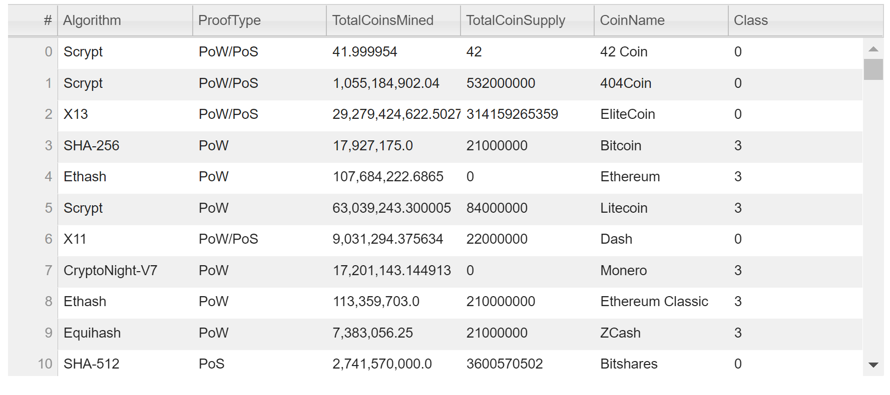
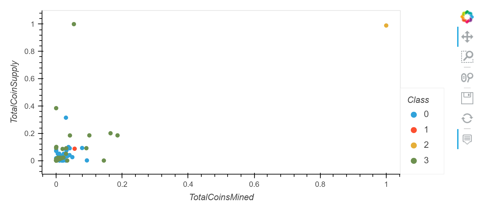
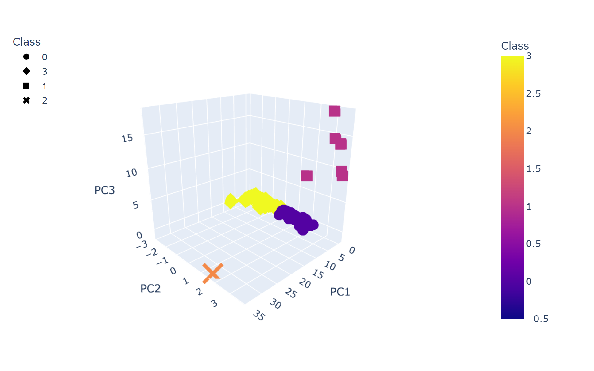

# Cryptocurrencies

## Overview
### Background
An investement bank is interested in offereing a new cryptocurrency investment porfolio for its customers, and wants to know how to group currently traded cryptocurrencies.
### Purpose
Create a report that includes what cryptocurrencies are on the trading market and how they could be grouped to create a classification system for new investments. 
## Results

